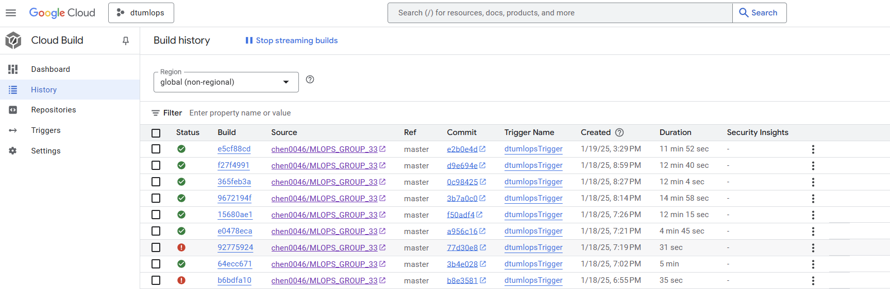

# Exam template for 02476 Machine Learning Operations

This is the report template for the exam. Please only remove the text formatted as with three dashes in front and behind
like:

```--- question 1 fill here ---```

Where you instead should add your answers. Any other changes may have unwanted consequences when your report is
auto-generated at the end of the course. For questions where you are asked to include images, start by adding the image
to the `figures` subfolder (please only use `.png`, `.jpg` or `.jpeg`) and then add the following code in your answer:

```markdown

```

In addition to this markdown file, we also provide the `report.py` script that provides two utility functions:

Running:

```bash
python report.py html
```

Will generate a `.html` page of your report. After the deadline for answering this template, we will auto-scrape
everything in this `reports` folder and then use this utility to generate a `.html` page that will be your serve
as your final hand-in.

Running

```bash
python report.py check
```

Will check your answers in this template against the constraints listed for each question e.g. is your answer too
short, too long, or have you included an image when asked. For both functions to work you mustn't rename anything.
The script has two dependencies that can be installed with

```bash
pip install typer markdown
```

## Overall project checklist

The checklist is *exhaustive* which means that it includes everything that you could do on the project included in the
curriculum in this course. Therefore, we do not expect at all that you have checked all boxes at the end of the project.
The parenthesis at the end indicates what module the bullet point is related to. Please be honest in your answers, we
will check the repositories and the code to verify your answers.

### Week 1

* [ ] Create a git repository (M5)
* [ ] Make sure that all team members have write access to the GitHub repository (M5)
* [ ] Create a dedicated environment for you project to keep track of your packages (M2)
* [ ] Create the initial file structure using cookiecutter with an appropriate template (M6)
* [ ] Fill out the `data.py` file such that it downloads whatever data you need and preprocesses it (if necessary) (M6)
* [ ] Add a model to `model.py` and a training procedure to `train.py` and get that running (M6)
* [ ] Remember to fill out the `requirements.txt` and `requirements_dev.txt` file with whatever dependencies that you
    are using (M2+M6)
* [ ] Remember to comply with good coding practices (`pep8`) while doing the project (M7)
* [ ] Do a bit of code typing and remember to document essential parts of your code (M7)
* [ ] Setup version control for your data or part of your data (M8)
* [ ] Add command line interfaces and project commands to your code where it makes sense (M9)
* [ ] Construct one or multiple docker files for your code (M10)
* [ ] Build the docker files locally and make sure they work as intended (M10)
* [ ] Write one or multiple configurations files for your experiments (M11)
* [ ] Used Hydra to load the configurations and manage your hyperparameters (M11)
* [ ] Use profiling to optimize your code (M12)
* [ ] Use logging to log important events in your code (M14)
* [ ] Use Weights & Biases to log training progress and other important metrics/artifacts in your code (M14)
* [ ] Consider running a hyperparameter optimization sweep (M14)
* [ ] Use PyTorch-lightning (if applicable) to reduce the amount of boilerplate in your code (M15)

### Week 2

* [ ] Write unit tests related to the data part of your code (M16)
* [ ] Write unit tests related to model construction and or model training (M16)
* [ ] Calculate the code coverage (M16)
* [ ] Get some continuous integration running on the GitHub repository (M17)
* [ ] Add caching and multi-os/python/pytorch testing to your continuous integration (M17)
* [ ] Add a linting step to your continuous integration (M17)
* [ ] Add pre-commit hooks to your version control setup (M18)
* [ ] Add a continues workflow that triggers when data changes (M19)
* [ ] Add a continues workflow that triggers when changes to the model registry is made (M19)
* [ ] Create a data storage in GCP Bucket for your data and link this with your data version control setup (M21)
* [ ] Create a trigger workflow for automatically building your docker images (M21)
* [ ] Get your model training in GCP using either the Engine or Vertex AI (M21)
* [ ] Create a FastAPI application that can do inference using your model (M22)
* [ ] Deploy your model in GCP using either Functions or Run as the backend (M23)
* [ ] Write API tests for your application and setup continues integration for these (M24)
* [ ] Load test your application (M24)
* [ ] Create a more specialized ML-deployment API using either ONNX or BentoML, or both (M25)
* [ ] Create a frontend for your API (M26)

### Week 3

* [ ] Check how robust your model is towards data drifting (M27)
* [ ] Deploy to the cloud a drift detection API (M27)
* [ ] Instrument your API with a couple of system metrics (M28)
* [ ] Setup cloud monitoring of your instrumented application (M28)
* [ ] Create one or more alert systems in GCP to alert you if your app is not behaving correctly (M28)
* [ ] If applicable, optimize the performance of your data loading using distributed data loading (M29)
* [ ] If applicable, optimize the performance of your training pipeline by using distributed training (M30)
* [ ] Play around with quantization, compilation and pruning for you trained models to increase inference speed (M31)

### Extra

* [ ] Write some documentation for your application (M32)
* [ ] Publish the documentation to GitHub Pages (M32)
* [ ] Revisit your initial project description. Did the project turn out as you wanted?
* [ ] Create an architectural diagram over your MLOps pipeline
* [ ] Make sure all group members have an understanding about all parts of the project
* [ ] Uploaded all your code to GitHub

## Group information

### Question 1
> **Enter the group number you signed up on <learn.inside.dtu.dk>**
>
> Answer:

Group 33

### Question 2
> **Enter the study number for each member in the group**
>
> Example:
>
> *sXXXXXX, sXXXXXX, sXXXXXX*
>
> Answer:

s205420, s242640, s147082, s140035

### Question 3
> **A requirement to the project is that you include a third-party package not covered in the course. What framework**
> **did you choose to work with and did it help you complete the project?**
>
> Recommended answer length: 100-200 words.
>
> Example:
> *We used the third-party framework ... in our project. We used functionality ... and functionality ... from the*
> *package to do ... and ... in our project*.
>
> Answer:

We used the third-party library SciPy in our project, which provided essential tools for handling sparse matrices and performing matrix operations efficiently. SciPy's sparse matrix functionality was crucial for working with the adjacency matrix and features of the graph in the Cora dataset. It allowed us to build and normalize large and sparse graph structures while maintaining memory efficiency.

The scipy.sparse module helped us create, manipulate, and normalize sparse matrices, which were later converted to dense matrices for processing with PyTorch. These operations included row-normalizing the adjacency matrix and feature matrix, as well as constructing a symmetric adjacency matrix for the graph.
Using SciPy simplified complex mathematical computations, making it easier to focus on developing and fine-tuning our Graph Attention Network (GAT) model.

## Coding environment

> In the following section we are interested in learning more about you local development environment. This includes
> how you managed dependencies, the structure of your code and how you managed code quality.

### Question 4

> **Explain how you managed dependencies in your project? Explain the process a new team member would have to go**
> **through to get an exact copy of your environment.**
>
> Recommended answer length: 100-200 words
>
> Example:
> *We used ... for managing our dependencies. The list of dependencies was auto-generated using ... . To get a*
> *complete copy of our development environment, one would have to run the following commands*
>
> Answer:

We used Conda for managing our dependencies in the project. The list of dependencies was auto-generated using a requirements.txt file, which includes all the necessary packages and their specific versions. To get a complete copy of our development environment, a new team member would need to follow a few simple steps. First, they would need to install Conda if not already installed. Then, they can create a new environment using the conda create command, followed by the requirements.txt file to install all the required dependencies. The commands would be as follows:

conda create --name <env_name> python=3.11
conda activate <env_name>
pip install -r requirements.txt
This ensures that the new team member has an identical environment with all the necessary libraries and dependencies installed, making it easy to start working on the project without any setup issues.

### Question 5

> **We expect that you initialized your project using the cookiecutter template. Explain the overall structure of your**
> **code. What did you fill out? Did you deviate from the template in some way?**
>
> Recommended answer length: 100-200 words
>
> Example:
> *From the cookiecutter template we have filled out the ... , ... and ... folder. We have removed the ... folder*
> *because we did not use any ... in our project. We have added an ... folder that contains ... for running our*
> *experiments.*
>
> Answer:

This project utilizes an adjusted project template, provided as part of the course, which is based on Cookiecutter but better suited for machine learning operations. This template removes some files unrelated to the project, such as LICENSE and notebooks. Using this template, we structured the project's file system. The `data` directory contains the datasets required for this project. The primary source code is stored in the `src` folder, which is divided into two subfolders: `config` and `final_project`. The `config` folder contains configuration files for the project, such as the configuration files used for parameter sweeps during multi-round training to find the optimal parameters. The `final_project` folder primarily holds the code for models, training, and validation. Additionally, to support the construction of Docker containers, the `dockerfiles` directory includes configuration files for building the container. The code for testing the model is stored in the `tests` directory.

### Question 6

> **Did you implement any rules for code quality and format? What about typing and documentation? Additionally,**
> **explain with your own words why these concepts matters in larger projects.**
>
> Recommended answer length: 100-200 words.
>
> Example:
> *We used ... for linting and ... for formatting. We also used ... for typing and ... for documentation. These*
> *concepts are important in larger projects because ... . For example, typing ...*
>
> Answer:

We have implemented documentation in our code, describing the purpose, inputs, and outputs of each function and module. However, we did not use explicit typing.

Typing would have been helpful in improving readability by making it clear what types of data are expected and returned by functions, reducing misunderstandings. In larger projects, where multiple developers are involved, typing ensures consistency and prevents errors when interacting with different parts of the code. It also helps with error prevention by enabling tools to catch mismatches early, and supports safer refactoring by ensuring changes don't break functionality. Overall, typing aids in collaboration and makes code more maintainable.

## Version control

> In the following section we are interested in how version control was used in your project during development to
> corporate and increase the quality of your code.

### Question 7

> **How many tests did you implement and what are they testing in your code?**
>
> Recommended answer length: 50-100 words.
>
> Example:
> *In total we have implemented X tests. Primarily we are testing ... and ... as these the most critical parts of our*
> *application but also ... .*
>
> Answer:

In total, we have implemented 3 tests. Primarily, we are testing the data loading and accuracy functions, as these are the most critical parts of our application for ensuring correct data preprocessing and performance evaluation. Additionally, we are testing the model implementation to verify its functionality and output, ensuring reliability in both data handling and model behavior.

### Question 8

> **What is the total code coverage (in percentage) of your code? If your code had a code coverage of 100% (or close**
> **to), would you still trust it to be error free? Explain you reasoning.**
>
> Recommended answer length: 100-200 words.
>
> Example:
> *The total code coverage of code is X%, which includes all our source code. We are far from 100% coverage of our **
> *code and even if we were then...*
>
> Answer:

The total code coverage of the code is 71.7%, which includes all our source code. We are far from 100% coverage of our code, and even if we were to achieve 100%, it wouldn't necessarily mean the code is error-free. Code coverage shows how much of the code is executed during testing, but it doesn’t guarantee that all possible scenarios are tested. Some edge cases or complex interactions between components might still be missed, even with full coverage. Therefore, while 100% coverage is desirable, it’s essential to ensure that the tests are comprehensive, covering different use cases and validating edge conditions, in addition to relying on manual checks or additional testing methods for greater confidence in the code's reliability.

### Question 9

> **Did you workflow include using branches and pull requests? If yes, explain how. If not, explain how branches and**
> **pull request can help improve version control.**
>
> Recommended answer length: 100-200 words.
>
> Example:
> *We made use of both branches and PRs in our project. In our group, each member had an branch that they worked on in*
> *addition to the main branch. To merge code we ...*
>
> Answer:

We made use of branching in our project to organize and manage our development workflow. Each team member worked on their own branch, separate from the main branch, to implement specific features or changes. This approach allowed us to work independently without disrupting the stability of the main branch.

Using branches ensured that each feature could be developed and tested in isolation before being merged into the main branch. This method reduces the risk of introducing bugs and helps maintain a clean and stable codebase. While we did not utilize pull requests, they could further enhance our version control by providing a structured way to review and discuss code changes before merging. Pull requests facilitate collaboration, improve code quality, and ensure that every change aligns with the project's standards.

### Question 10

> **Did you use DVC for managing data in your project? If yes, then how did it improve your project to have version**
> **control of your data. If no, explain a case where it would be beneficial to have version control of your data.**
>
> Recommended answer length: 100-200 words.
>
> Example:
> *We did make use of DVC in the following way: ... . In the end it helped us in ... for controlling ... part of our*
> *pipeline*
>
> Answer:

We did make use of DVC (Data Version Control) in our project to manage data. DVC helped us by enabling version control for our datasets and model artifacts. It allowed us to track changes over time, ensuring we could revert to previous versions when necessary. This was particularly useful for managing large data files, as DVC avoids the need to store them directly in Git. Additionally, DVC facilitated collaboration by allowing team members to easily share and sync data versions, maintaining consistency across the project. Overall, DVC improved our workflow by providing a structured way to manage and version control data, ensuring better reproducibility and traceability in our pipeline.

### Question 11

> **Discuss you continuous integration setup. What kind of continuous integration are you running (unittesting,**
> **lintin1g, etc.)? Do you test multiple operating systems, Python  version etc. Do you make use of caching? Feel free**
> **to insert a link to one of your GitHub actions workflow.**
>
> Recommended answer length: 200-300 words.
>
> Example:
> *We have organized our continuous integration into 3 separate files: one for doing ..., one for running ... testing*
> *and one for running ... . In particular for our ..., we used ... .An example of a triggered workflow can be seen*
> *here: <weblink>*
>
> Answer:

We have organized our continuous integration into one file that focuses on unit testing. This file runs the tests we have implemented, such as verifying the data loading, accuracy function, and model behavior. To ensure broad compatibility, we have tested across multiple operating systems, including Linux, Windows, and macOS, as well as Python versions 3.10, 3.11, and 3.12. While adding these combinations enhanced our test coverage, it also doubled the runtime due to the increased matrix of tests.

To mitigate this, we incorporated caching into our workflow. This optimization significantly reduced the runtime, improving it by approximately 30%. Caching particularly benefits repetitive tasks like dependency installation, making our continuous integration pipeline more efficient without compromising on thorough testing. An example of a triggered workflow can be seen below
<https://github.com/chen0046/MLOPS_GROUP_33/actions/runs/12797433854>

## Running code and tracking experiments

> In the following section we are interested in learning more about the experimental setup for running your code and
> especially the reproducibility of your experiments.

### Question 12

> **How did you configure experiments? Did you make use of config files? Explain with coding examples of how you would**
> **run a experiment.**
>
> Recommended answer length: 50-100 words.
>
> Example:
> *We used a simple argparser, that worked in the following way: Python  my_script.py --lr 1e-3 --batch_size 25*
>
> Answer:

For the experimental configuration, we utilized the argparser package to define the model parameters, training hyperparameters, and other related settings during the training process. Additionally, for the sweep process that scans various parameters to obtain the best model training results, we created a YAML file to specify the selection range of parameters such as dropout, lr, hidden, etc. This configuration file is passed to the wandb.init() function to facilitate parameter sweep training using WandB.

### Question 13

> **Reproducibility of experiments are important. Related to the last question, how did you secure that no information**
> **is lost when running experiments and that your experiments are reproducible?**
>
> Recommended answer length: 100-200 words.
>
> Example:
> *We made use of config files. Whenever an experiment is run the following happens: ... . To reproduce an experiment*
> *one would have to do ...*
>
> Answer:

 We first set up a configuration file to record the specific values of the hyperparameters related to model training. This ensures consistency in parameters for future executions of the project, making it easier to reproduce results and identify which hyperparameters are most effective for our specific problem. Additionally, after the model training is completed, we store the best set of parameter files from the training in the project structure for subsequent validation and practical use. Furthermore, we save the parameter files of the training results on the WandB platform, enabling us to conveniently review and retrieve the results of different training runs.

### Question 14

> **Upload 1 to 3 screenshots that show the experiments that you have done in W&B (or another experiment tracking**
> **service of your choice). This may include loss graphs, logged images, hyperparameter sweeps etc. You can take**
> **inspiration from [this figure](figures/wandb.png). Explain what metrics you are tracking and why they are**
> **important.**
>
> Recommended answer length: 200-300 words + 1 to 3 screenshots.
>
> Example:
> *As seen in the first image when have tracked ... and ... which both inform us about ... in our experiments.*
> *As seen in the second image we are also tracking ... and ...*
>
> Answer:

On the WandB platform, we tracked the change in the training loss on the training set as the number of epochs increased, as shown in the figure below:


We observed that the training performed well, with the loss decreasing rapidly and then gradually stabilizing within a certain range.
At the same time, we tracked the change in validation accuracy as the training batches increased, as shown in the figure below:


It was observed that the training accuracy quickly increased and then stabilized around 82% in validation accuracy.
Additionally, we performed multiple rounds of training using hyperparameter scanning to determine the best hyperparameter combination, and the results are shown in the figure below:


### Question 15

> **Docker is an important tool for creating containerized applications. Explain how you used docker in your**
> **experiments/project? Include how you would run your docker images and include a link to one of your docker files.**
>
> Recommended answer length: 100-200 words.
>
> Example:
> *For our project we developed several images: one for training, inference and deployment. For example to run the*
> *training docker image: `docker run trainer:latest lr=1e-3 batch_size=64`. Link to docker file: <weblink>*
>
> Answer:

In our project, Docker was used to create a containerized environment for both the training and inference phases. During the training phase, Docker ensured a consistent and reproducible environment for the training dataset and scripts, regardless of the system. This helped in maintaining uniformity across different environments. In the inference phase, Docker was used to package the trained model and inference scripts into a container, making it easy to deploy the model across various environments.

For deployment, the containerized environment was deployed to production systems such as cloud services or local servers to ensure that the model runs consistently. This also simplified the process of scaling and managing the deployed model.

We use 'docker build -f Dockerfile -t model_train' to build the Docker image.You can find the link to the Dockerfile used for training here: <https://github.com/chen0046/MLOPS_GROUP_33/tree/master/Dockerfile>

### Question 16

> **When running into bugs while trying to run your experiments, how did you perform debugging? Additionally, did you**
> **try to profile your code or do you think it is already perfect?**
>
> Recommended answer length: 100-200 words.
>
> Example:
> *Debugging method was dependent on group member. Some just used ... and others used ... . We did a single profiling*
> *run of our main code at some point that showed ...*
>
> Answer:


Our debugging method mainly involved using the built-in debugger in VS Code. We set breakpoints, stepped through the code, and inspected variables to identify issues. This approach helped us locate problems, especially when working with complex data or model-related bugs. In addition, we used print statements for quick checks during development to track variable values and the flow of execution.

We did not perform extensive profiling of our code, as performance was not a major concern for this project. However, we did monitor key operations to ensure they were running efficiently. Overall, the debugging process and the performance were adequate for the scope of our project.

## Working in the cloud

> In the following section we would like to know more about your experience when developing in the cloud.

### Question 17

> **List all the GCP services that you made use of in your project and shortly explain what each service does?**
>
> Recommended answer length: 50-200 words.
>
> Example:
> *We used the following two services: Engine and Bucket. Engine is used for... and Bucket is used for...*
>
> Answer:

Bucket Used for storing and managing large datasets and model artifacts. It provides scalable object storage for easy access and sharing (data version control).
Compute Engine Used to run virtual machines (VMs) for training models and performing resource-intensive tasks. It offers flexible compute power for various workloads.
Cloud Build Used for automating the building, testing, and deployment of our code. It helps in continuous integration and continuous delivery (CI/CD) of our project.
Triggers Used to automate workflows and trigger Cloud Build processes based on specific events, such as pushing code to the repository.
Vertex AI Used for managing machine learning models, training, and deployment. It provides a fully managed environment for ML workflows and facilitates model monitoring and retraining.
Artifact Registry Used for managing and storing Docker images and other artifacts. It helps us to version control and deploy containerized applications efficiently.

### Question 18

> **The backbone of GCP is the Compute engine. Explained how you made use of this service and what type of VMs**
> **you used?**
>
> Recommended answer length: 100-200 words.
>
> Example:
> *We used the compute engine to run our ... . We used instances with the following hardware: ... and we started the*
> *using a custom container: ...*
>
> Answer:

In this project, we did not use Google Cloud's Compute Engine. We used Vertex AI to handle model training and deployment tasks. Vertex AI provides a streamlined and managed environment for machine learning workflows, simplifying our process by abstracting infrastructure management. This approach allowed us to focus on model development and experimentation without the need to manage underlying resources.

### Question 19

> **Insert 1-2 images of your GCP bucket, such that we can see what data you have stored in it.**
> **You can take inspiration from [this figure](figures/bucket.png).**
>
> Answer:


### Question 20

> **Upload 1-2 images of your GCP artifact registry, such that we can see the different docker images that you have**
> **stored. You can take inspiration from [this figure](figures/registry.png).**
>
> Answer:


### Question 21

> **Upload 1-2 images of your GCP cloud build history, so we can see the history of the images that have been build in**
> **your project. You can take inspiration from [this figure](figures/build.png).**
>
> Answer:



### Question 22

> **Did you manage to train your model in the cloud using either the Engine or Vertex AI? If yes, explain how you did**
> **it. If not, describe why.**
>
> Recommended answer length: 100-200 words.
>
> Example:
> *We managed to train our model in the cloud using the Engine. We did this by ... . The reason we choose the Engine*
> *was because ...*
>
> Answer:

We managed to train our model in the cloud using Vertex AI. First, we built the Docker image for this project in Google Cloud and uploaded it to Artifact Registry. Then, we created the cloudbuild.yaml configuration file, setting the image address and the cloud server region, among other configurations. Finally, we used a command in combination with the configuration file to create the Vertex AI training job. On the platform, we were able to view real-time training status and monitor progress. The reason we chose Vertex AI is that it offers convenient cloud-based model training and monitoring features, allowing us to fully leverage Google Cloud's computational resources, improving training efficiency and scalability.

## Deployment

### Question 23

> **Did you manage to write an API for your model? If yes, explain how you did it and if you did anything special. If**
> **not, explain how you would do it.**
>
> Recommended answer length: 100-200 words.
>
> Example:
> *We did manage to write an API for our model. We used FastAPI to do this. We did this by ... . We also added ...*
> *to the API to make it more ...*
>
> Answer:

We used FastAPI to create an API for the model's prediction results. First, we built a simple FastAPI application and loaded the best-performing model from previous training into memory. In this API, we set up a POST request endpoint that accepts two input prediction files and performs inference on the data, returning the prediction results. To improve performance, we implemented asynchronous processing, particularly when loading the model and certain parameters, ensuring that the API can respond quickly without being blocked by the loading process. Additionally, we performed data preprocessing and validation to ensure the correctness and consistency of the input data, preventing any invalid data from causing model errors.

### Question 24

> **Did you manage to deploy your API, either in locally or cloud? If not, describe why. If yes, describe how and**
> **preferably how you invoke your deployed service?**
>
> Recommended answer length: 100-200 words.
>
> Example:
> *For deployment we wrapped our model into application using ... . We first tried locally serving the model, which*
> *worked. Afterwards we deployed it in the cloud, using ... . To invoke the service an user would call*
> *`curl -X POST -F "file=@file.json"<weburl>`*
>
> Answer:

We deployed the API in the cloud. First, we used FastAPI to wrap the model into an application and tested its functionality locally using Swagger to ensure that the API endpoints could correctly handle input data and return prediction results. Then, we containerized the API application, created a `Dockerfile` to build the image, and pushed the image to Google Cloud Artifact Registry via Docker for cloud access and deployment. Next, we used Google Cloud Run to deploy the image to the cloud, successfully providing a scalable API service. Google Cloud Run allows our API to automatically scale based on load, ensuring high availability. This approach not only ensures the stable operation of the model in the cloud but also allows us to easily manage and update the service.

### Question 25

> **Did you perform any unit testing and load testing of your API? If yes, explain how you did it and what results for**
> **the load testing did you get. If not, explain how you would do it.**
>
> Recommended answer length: 100-200 words.
>
> Example:
> *For unit testing we used ... and for load testing we used ... . The results of the load testing showed that ...*
> *before the service crashed.*
>
> Answer:

We performed both unit testing and load testing on the API. For unit testing, we used the testing client provided by FastAPI to validate the functionality, ensuring that each endpoint correctly handles inputs and returns the expected outputs. For load testing, we used the Locust tool to simulate a large number of concurrent users accessing the API. The results of the tests showed that the average response time of our API was 11.2 seconds, and the 99th percentile response time was 18.3 seconds.

### Question 26

> **Did you manage to implement monitoring of your deployed model? If yes, explain how it works. If not, explain how**
> **monitoring would help the longevity of your application.**
>
> Recommended answer length: 100-200 words.
>
> Example:
> *We did not manage to implement monitoring. We would like to have monitoring implemented such that over time we could*
> *measure ... and ... that would inform us about this ... behaviour of our application.*
>
> Answer:

We utilized Google Cloud Monitoring to track the performance of our API and model. By configuring Cloud Monitoring, we can monitor critical API metrics in real-time, such as response time, request volume, error rates, and resource usage. We defined key performance indicators like requests per second and average response time, which are accessible through the dashboard. We also implemented regular health checks to ensure the API operates smoothly and enabled Cloud Logging to capture all API requests and error logs, allowing us to quickly identify and debug potential issues. Additionally, we monitor the computational resources used by the model, such as CPU and memory, to ensure the API remains stable during high traffic periods.

## Overall discussion of project

> In the following section we would like you to think about the general structure of your project.

### Question 27

> **How many credits did you end up using during the project and what service was most expensive? In general what do**
> **you think about working in the cloud?**
>
> Recommended answer length: 100-200 words.
>
> Example:
> *Group member 1 used ..., Group member 2 used ..., in total ... credits was spend during development. The service*
> *costing the most was ... due to ... . Working in the cloud was ...*
>
> Answer:

Group member 1 used $8.56 of the total $50 credits allocated for the project, while Group member 2 used $3.23. The most expensive services were Compute Engine and Container Registry. Compute Engine costs were driven by the use of virtual machines for training and testing the model, which required significant computational resources. Container Registry contributed to the costs due to storing and managing multiple Docker images for our builds and deployments.
Overall, working in the cloud was a valuable experience. It allowed us to scale resources as needed and integrate various services seamlessly, but managing costs and configurations required careful planning and attention.

### Question 28

> **Did you implement anything extra in your project that is not covered by other questions? Maybe you implemented**
> **a frontend for your API, use extra version control features, a drift detection service, a kubernetes cluster etc.**
> **If yes, explain what you did and why.**
>
> Recommended answer length: 0-200 words.
>
> Example:
> *We implemented a frontend for our API. We did this because we wanted to show the user ... . The frontend was*
> *implemented using ...*
>
> Answer:

--- question 28 fill here ---

### Question 29

> **Include a figure that describes the overall architecture of your system and what services that you make use of.**
> **You can take inspiration from [this figure](figures/overview.png). Additionally, in your own words, explain the**
> **overall steps in figure.**
>
> Recommended answer length: 200-400 words
>
> Example:
>
> *The starting point of the diagram is our local setup, where we integrated ... and ... and ... into our code.*
> *Whenever we code and push to GitHub, it auto triggers ... and ... . From there the diagram shows ...*
>
> Answer:

--- question 29 fill here ---

### Question 30

> **Discuss the overall struggles of the project. Where did you spend most time and what did you do to overcome these**
> **challenges?**
>
> Recommended answer length: 200-400 words.
>
> Example:
> *The biggest challenges in the project was using ... tool to do ... . The reason for this was ...*
>
> Answer:

The biggest challenge in the project was using the cloud to train our model. This process involved integrating several Google Cloud Platform (GCP) services, including Compute Engine, Artifact Registry, and Vertex AI. Each service required precise configuration, and ensuring smooth communication between them was challenging. Additionally, managing permissions for these services was a significant hurdle, as even minor misconfigurations could prevent the pipeline from functioning correctly.

The most critical and time-consuming aspect was creating a functional cloudbuild.yaml and Dockerfile. These files are essential for automating the build and deployment process, but they required meticulous attention to detail. Errors in these configurations, such as incorrect dependency management or misaligned build steps, often caused build failures or runtime errors. Debugging these issues demanded significant effort and often slowed our progress.

To overcome these challenges, we broke down the problem into smaller tasks and systematically addressed each issue. We relied heavily on GCP documentation, tutorials, and community forums for guidance. Iterative testing and debugging played a key role in identifying and resolving errors in our configuration files.
Through persistence and teamwork, we managed to configure the pipeline successfully. While time-consuming, this process deepened our understanding of cloud infrastructure and CI/CD workflows, ultimately becoming one of the most rewarding aspects of the project.

### Question 31

> **State the individual contributions of each team member. This is required information from DTU, because we need to**
> **make sure all members contributed actively to the project. Additionally, state if/how you have used generative AI**
> **tools in your project.**
>
> Recommended answer length: 50-300 words.
>
> Example:
> *Student sXXXXXX was in charge of developing of setting up the initial cookie cutter project and developing of the*
> *docker containers for training our applications.*
> *Student sXXXXXX was in charge of training our models in the cloud and deploying them afterwards.*
> *All members contributed to code by...*
> *We have used ChatGPT to help debug our code. Additionally, we used GitHub Copilot to help write some of our code.*
> Answer:

Student s205420 was in charge of setting up the initial Cookiecutter project, configuring the folder structure, and creating the Docker containers necessary for training and deployment. He also worked extensively on debugging and finalizing the cloudbuild.yaml file.

Student s242640 led the efforts in training the models using Vertex AI and deploying them in the cloud. He managed the integration of Compute Engine, Artifact Registry, and Container Registry into the pipeline and ensured the correct permissions were granted across services.

Student s147082 supported the project by testing various parts of the codebase, including debugging issues in the model and ensuring that cloud integrations were functional during development.

Student s140035 contributed by assisting with data preparation and verifying the dataset integrity. He also helped with validating the results of the trained model and documenting the final pipeline setup.

All members contributed to the overall progress by providing feedback on code, discussing challenges, and ensuring the project stayed on track.